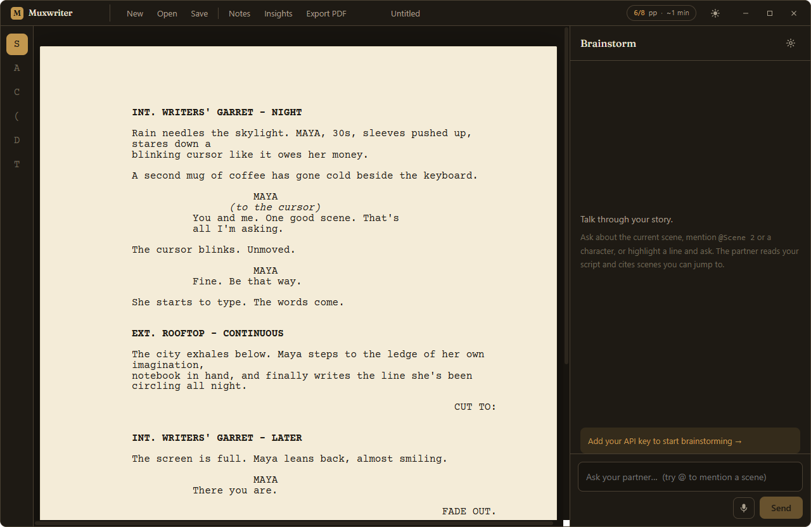

# Muxwriter

**A desktop screenwriting app with an AI brainstorming partner who actually
knows your story.**

Muxwriter pairs a strict, industry format script editor with a conversational
AI partner you can talk through plot, character, and structure with. Like
Celtx, but with a writing companion built in rather than a formatting tool
alone. Free, open source, and distributed entirely through GitHub.

[](https://github.com/ankitmukhopadhyay/Muxwriter/releases/latest)
[](LICENSE)



## Highlights

- **Industry standard formatting** built on the [Fountain](https://fountain.io)
  markup standard, rendered on a cream script page in Courier Prime with a live
  page count to runtime indicator (about one page per minute).
- **An AI brainstorming partner** that is context aware of your actual script,
  not generic advice. It pulls in past scenes on its own with `search_script`
  and `get_scene` tools, cites scenes you can click to jump to, and can propose
  edits you accept or reject in an in editor diff. It never changes your words
  silently.
- **Selection and mentions.** Highlight a line and ask about it, or type
  `@Scene 14` or `@Maya` to pull a scene or character into context.
- **Insights and notes** derived from the same parsed structure: character and
  scene breakdowns, plus per scene, per character, and global notes.
- **Export** to a screenplay accurate PDF (12pt Courier, correct margins) and
  your brainstorm transcript to Markdown.
- **Local first and BYOK.** Your scripts are plain text `.muxw` files on your
  machine. AI calls go directly from the app to your chosen provider using your
  own API key, stored locally. There is no backend server.
- **Built with Tauri** for a small, fast, secure native app, with light and
  dark themes for long writing sessions.

## Download

Grab the latest Windows installer from the
[releases page](https://github.com/ankitmukhopadhyay/Muxwriter/releases/latest).

> The Windows installer is currently unsigned, so SmartScreen may warn on first
> run (choose "More info" then "Run anyway"). Code signing through SignPath for
> verified open source projects is planned.

## Bring Your Own Key (BYOK)

Muxwriter does not host or proxy any AI. You supply your own API key, and it is
stored locally and sent only to the provider you choose.

1. Get an Anthropic API key from
   [the Anthropic Console](https://console.anthropic.com/).
2. In Muxwriter, open **Settings** (the gear in the Brainstorm sidebar).
3. Choose **Anthropic (Claude)**, paste your key, and pick a model (Claude Opus
   4.8 by default).
4. Start a conversation in the sidebar. The partner reads your current scene
   and any story bible and notes you have written.

Your key never leaves your machine except in requests to the provider.

## Building from source

Prerequisites: Node.js 20+, the Rust stable toolchain (1.85 or newer), and the
Tauri platform build dependencies (see
[Tauri prerequisites](https://tauri.app/start/prerequisites/)).

```bash
npm install
npm run tauri dev      # run the desktop app with hot reload
npm run tauri build    # produce a release installer
npm test               # run the unit tests
```

See `CONTRIBUTING.md` for the full development guide, and
`docs/muxwriter-spec.md` / `docs/muxwriter-build-plan.md` for the design and
roadmap.

## Releasing

Push a semver tag and GitHub Actions builds and publishes the installer:

```bash
git tag v0.1.0
git push origin v0.1.0
```

The workflow (`.github/workflows/release.yml`) creates a draft GitHub Release
with the installer attached.

## License

[MIT](LICENSE)
